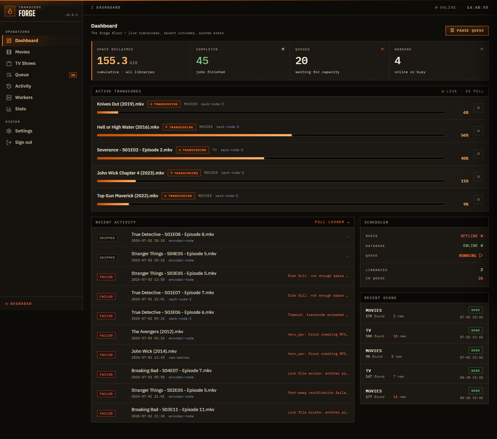
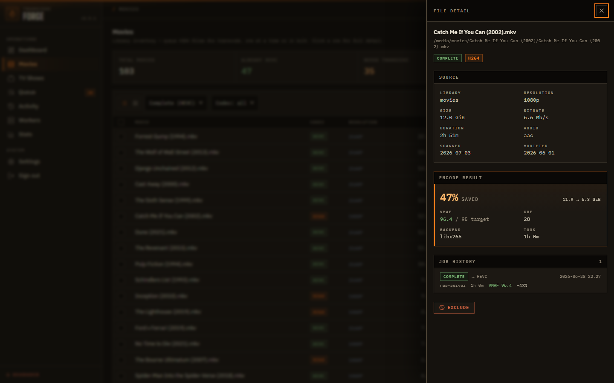
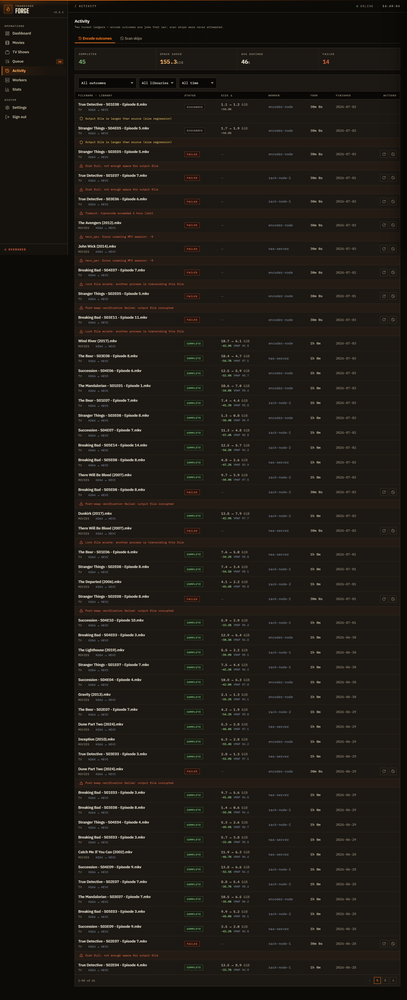

# Transcode Forge

[](https://github.com/nuffy94/transcode-forge/actions/workflows/tests.yml)


A self-hosted transcoder that shrinks your media library into modern,
efficient codecs — HEVC and AV1 today, with room for whatever comes next.
One scheduler, as many worker machines as you've got, and an 8-step pipeline
with one obsession: never lose an original — even if a worker dies mid-encode.

- **Atomic 8-step pipeline** — lock → transcode → verify → compare →
  swap → confirm → cleanup → unlock. The original file is always
  recoverable.
- **Decode healthcheck on every swap** — not just an ffprobe. Actual
  frames are pushed through the decoder at three offsets before the
  file is kept.
- **Distribute across your machines** — each worker picks the best encoder it
  has: Intel QSV or NVIDIA NVENC on Linux, software x265 as a universal
  fallback. Workers connect HTTP-only with a revocable token and never see DB
  or Redis credentials.
- **No file ever lost** — orphan-job detection, integrity audit, and
  cross-view consistency tests so the dashboard never lies about state.

> **Status**: actively developed, in production use. Self-hostable;
> install in three commands.

## The console

A dense ops console — live transcodes with per-worker attribution, honest
zero states, and a VMAF readout on every finished encode. Fully self-hosted
chrome: fonts, icons, and scripts are all vendored, so the UI loads nothing
from third-party hosts.



Click any file for the full story — probe data, encode economics (savings,
achieved VMAF vs. target, CRF, encoder backend), and the complete attempt
timeline:



The Activity ledger keeps two honest books: encode outcomes (jobs that ran,
including ones discarded for size regression or a missed VMAF floor) and
scan skips (files never attempted — already HEVC, wrong codec):



## Install — 60 seconds

Requires Docker (or Podman) and Compose. Developed and run on Linux; the
containerized stack should also run on macOS or Windows via Docker Desktop,
but those aren't regularly tested.

```bash
git clone https://github.com/nuffy94/transcode-forge.git
cd transcode-forge

# Generate random secrets in .env. Idempotent — safe to re-run.
./bootstrap.sh        # or: powershell -File bootstrap.ps1

# Edit .env to point TF_LIBRARY_MOVIES / TF_LIBRARY_TV at your library.
$EDITOR .env

docker compose up -d
```

Open http://localhost:8000 and pick an admin password on the setup screen.
From there you scan your library, queue jobs, and watch progress on the
dashboard.

### Pre-built image (skip the build)

Tagged releases publish a public image to GHCR — no registry login needed.
Use the production compose file:

```bash
./bootstrap.sh
docker compose -f docker-compose.prod.yml up -d   # pulls ghcr.io/nuffy94/transcode-forge
```

Pin a version with `TF_VERSION=0.7.0` in `.env` (defaults to `:latest`).

### Deploying on Linode

Two StackScripts deploy the full stack on Linode Compute — Caddy TLS edge,
Object Storage media plane, optional Managed Database, and token-joined
CPU workers. See [deploy/linode/README.md](deploy/linode/README.md).

## Adding workers

The scheduler can transcode by itself, but the point of having a separate
**worker** process is so you can spread the work across machines — a box with
an NVIDIA GPU at night, another with Intel QSV during the day, or any spare
machine with ffmpeg.

The quickest path is in the UI: **Workers → Add a worker** issues a token and
hands you a ready-to-paste **Docker** or **`uv`** join command, with the storage
notes for your library type (read-write media mount for filesystem libraries;
bucket credentials for S3). To wire one up by hand instead:

1. **Workers → Add a worker** (or **Settings → Workers**) → issue a token,
   label it "gpu-node" (or whatever), copy it (it's shown once).
2. On the worker machine, install [uv](https://docs.astral.sh/uv/) and a
   recent ffmpeg with the right hardware encoder — or just run the published
   Docker image (it bundles ffmpeg): `ghcr.io/nuffy94/transcode-forge:latest`
   with the command `python -m transcode_forge.worker`.
3. Set environment variables:

```bash
TF_SERVER_URL=http://<scheduler-host>:8000
TF_WORKER_TOKEN=<paste-the-token>
TF_WORKER_NAME=gpu-node
TF_PREFERRED_ENCODER=auto         # or qsv / nvenc / cpu
TF_PATH_MAP='{"/media/movies":"/mnt/media/movies"}'
```

`TF_PATH_MAP` translates the path the scheduler stores into the path the
worker can read on its own filesystem. Empty if both machines mount the
library identically.

4. Run the worker:

```bash
uv run python -m transcode_forge.worker
```

It registers itself with the scheduler and starts pulling jobs. The
dashboard shows it under Workers within a heartbeat interval (~10s).

To stop using a worker (machine retired, token leaked, whatever), go to
**Settings → Workers → revoke**. Its next request is rejected and it
exits cleanly.

## Configuration

Everything is configured through environment variables (`TF_*`) or the
admin UI (libraries, schedules, exclusions, worker tokens).

| Common knobs | What it does |
|---|---|
| `TF_LIBRARY_MOVIES`, `TF_LIBRARY_TV` | Library paths the scheduler scans |
| `TF_QUALITY_MOVIES`, `TF_QUALITY_TV` | HEVC CRF (lower = bigger, better) |
| `TF_PORT` | Web UI port (default 8000) |
| `TF_LOG_LEVEL` | Log verbosity: `debug` / `info` / `warning` / `error` (default `info`) |
| `TF_SESSION_SECURE` | Set `true` when serving over HTTPS so the session cookie is Secure-only |
| `TF_AUTH_SECRET` | Cookie-signing secret. Pinning makes sessions survive restarts |

**Guides:** [Getting Started](docs/GETTING-STARTED.md) ·
[Troubleshooting](docs/TROUBLESHOOTING.md) · [Backup](docs/BACKUP.md) ·
[Upgrade](docs/UPGRADE.md) · [Staging](docs/STAGING.md) ·
[Changelog](CHANGELOG.md). For the exhaustive
env-var list and internal architecture, see [CLAUDE.md](./CLAUDE.md).

## Security

Single-admin, built for a network you control.

- **Exposure** — the web UI binds `0.0.0.0` by default (LAN-reachable). Postgres
  and Redis are **never** published to the host;
  they live only on the internal Docker network.
- **Untrusted networks / the internet** — don't expose the UI directly. Set
  `TF_BIND=127.0.0.1` and put a TLS reverse proxy (Caddy, nginx) or a
  Cloudflare Tunnel in front, with `TF_SESSION_SECURE=true`
  so the session cookie is HTTPS-only.
- **Secrets** — `bootstrap.sh` generates `TF_PG_PASSWORD` and
  `TF_AUTH_SECRET`; `.env` is git-ignored. Cross-site requests are rejected
  (CSRF protection on state-changing routes).
- **Workers** hold only the scheduler URL + a revocable bearer token — never
  DB or Redis credentials. Tokens are stored hashed (HMAC-SHA256), not in the
  clear.

**Reverse proxy with automatic HTTPS (Caddy).** Front the app with this
`Caddyfile` and Caddy provisions and renews the TLS cert for you:

```caddyfile
forge.example.com {
    reverse_proxy localhost:8000
}
```

Then set in `.env`: `TF_BIND=127.0.0.1` (only the proxy reaches the app) and
`TF_SESSION_SECURE=true` (session cookie becomes HTTPS-only). A Cloudflare
Tunnel gives you the same TLS without opening a port.
**Never expose `:8000` directly over plain HTTP** — the admin password and
worker tokens would travel unencrypted.

## What it does (and doesn't)

**Does**:
- Watches your media library, finds the files worth re-encoding, queues them
- Distributes work to one or more workers (QSV / NVENC / CPU)
- Verifies every output before replacing the original
- Re-queues stuck jobs if a worker disappears mid-transcode
- Shows live progress, history, savings stats, integrity audit
- Schedules: "only transcode between 11pm and 7am on weekdays"
- Excludes: "never try this file again" with one click

**Doesn't (yet)**:
- Plugin/flow editor. Roadmap: v1.0.
- Multi-output profiles (e.g. an h264 fallback file alongside the HEVC one).
- An arm64 image — amd64 only for now (the Intel QSV apt packages block arm64).

## Hardware encoder support

| Encoder | Platform | What you need |
|---|---|---|
| Intel QSV | Linux (gen8+) | `intel-media-va-driver-non-free` + `libmfx1` (gen8-10) or `libmfx-gen` (gen11+); pass `/dev/dri` into the container |
| NVIDIA NVENC | Linux | Driver 470+, `nvidia-container-toolkit` if running in Docker. Should also work on Windows, but that's untested. |
| Software x265 | Anywhere | Slow, but always works. The only encoder path on macOS, though macOS itself is untested. |

Workers detect available encoders at startup and pick the best one. Set
`TF_PREFERRED_ENCODER` to `qsv`, `nvenc`, or `cpu` to force a specific one.
Linux is the tested platform; the Windows and macOS paths above are best-effort.

## Pipeline safety

Every transcode goes through eight steps:

```
LOCK → TRANSCODE → VERIFY → COMPARE → SWAP → CONFIRM → CLEANUP → UNLOCK
```

If a step fails, the original is preserved. The output is
verified by ffprobe AND a real decode of frames at three offsets before
the swap happens. If the post-swap file fails its decode check, the
original is restored from `.tf_bak`.

Stuck jobs (worker crashed mid-transcode) are detected by the integrity
audit endpoint at `/api/audit/integrity`. The dashboard surfaces them
and an admin can re-queue or exclude them.

## Development

```bash
uv sync --extra dev --dev
uv run pytest                       # ~480 tests, about a minute
uv run pytest tests/test_pipeline.py
uv run ruff check src/ tests/
uv run mypy src/
```

The repo has separate test suites for unit tests, repository tests,
HTTP handler tests, view-consistency tests, schema migrations, and the
worker HTTP API. Run `pytest -k <name>` to filter.

## License

MIT. See [LICENSE](./LICENSE).
